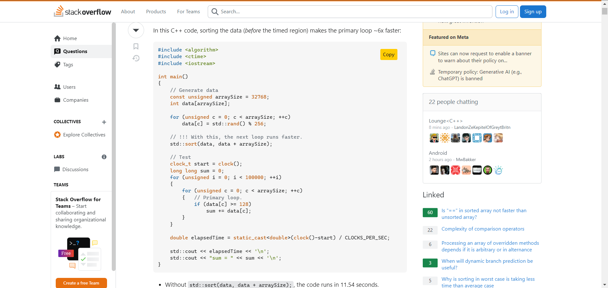

# CopyPaster Project


[](chrome://extensions/)

CopyPaster is a browser extension that provides a "Copy" button for code snippets on [Stack Overflow](https://stackoverflow.com/), allowing you to quickly copy code and paste it wherever you need.

## Table of Contents

-  [Folder Structure](#folder-structure)
-  [Usage](#usage)
-  [Media](#Media)
-  [Contributing](#contributing)
-  [Dependencies](#dependencies)

## Folder Structure

-  **\_locales:** Containing language files used for internationalization and localization.
-  **icons:** Storing icon images utilized by the extension.
-  **js:** JavaScript files responsible for the core functionality of the extension.
-  **html:** HTML files corresponding to various components of the extension.
-  **manifest.json:** Encompassing metadata such as the extension's name, version, permissions, and other details.

## Usage

1. Clone the repository:

```bash
git clone https://github.com/HEAD0223/copyPaster.git
cd copyPaster
```

2. Go to [chrome://extensions/](chrome://extensions/)

   -  Click on "Load unpacked" and select the cloned directory.

3. Enjoy the "Copy" button on Stack Overflow!

## Media





## Contributing

If you would like to contribute to this project, please follow these steps:

1. Fork the repository.
2. Create a new branch for your feature: `git checkout -b feature-name`
3. Commit your changes: `git commit -m 'Add some feature'`
4. Push to the branch: `git push origin feature-name`
5. Submit a pull request.
